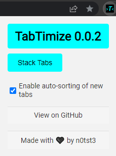

# TabTimize

 

TabTimize is a lightweight Google Chrome tab optimizer that helps you manage your tabs more efficiently. 

With TabTimize, you can quickly and easily group your tabs by domain and reduce clutter in your browser window.

## Features

Group tabs by domain with a single click

Auto-group tabs by domain when enabled in settings

Lightweight and easy to use

Saves your settings for convenience

## Usage

To use TabTimize, simply click the "Group Tabs" button in the popup window to group all of your tabs by domain. To enable auto-grouping, toggle the checkbox in the popup window.

#### Contributing

TabTimize is a work in progress and contributions are warmly welcomed. To contribute, fork the repository and submit a pull request.

##### ToDo
~~Implement and style popup/UI HTML~~ **DONE**

Implement additional options

~~Implement about/git link~~ **DONE**

Implement auto naming of groups by domain

###### License
This project is licensed under the MIT License - see the LICENSE.md file for details.
